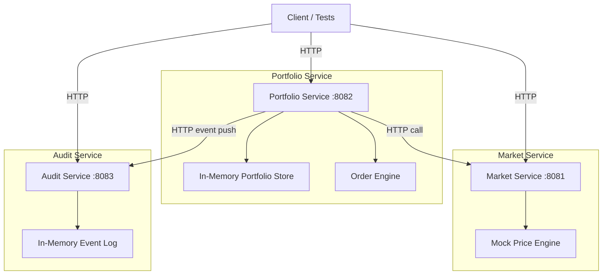

# Mini Exchange Portfolio System - Implementation Plan

## Overview

Xây dựng một trading platform backend đơn giản gồm 3 microservices bằng Rust, giao tiếp qua HTTP (REST), sử dụng in-memory storage, orchestrated bằng Docker Compose.

## Architecture



## Tech Stack

| Component | Technology |
|-----------|-----------|
| Language | Rust (stable) |
| HTTP Framework | `actix-web` 4 |
| HTTP Client | `reqwest` |
| Serialization | `serde` / `serde_json` |
| Async Runtime | `tokio` |
| UUID | `uuid` |
| Logging | `tracing` + `tracing-subscriber` |
| Testing | Built-in `#[cfg(test)]` + integration tests |
| Containerization | Docker + Docker Compose |

## Project Structure

```
mini-exchange/
├── Cargo.toml                  # Workspace root
├── docker-compose.yml
├── Dockerfile.market
├── Dockerfile.portfolio
├── Dockerfile.audit
├── README.md
├── AI_USAGE.md
├── market-service/
│   ├── Cargo.toml
│   └── src/
│       ├── main.rs
│       ├── handlers.rs
│       ├── models.rs
│       └── price_engine.rs
├── portfolio-service/
│   ├── Cargo.toml
│   └── src/
│       ├── main.rs
│       ├── handlers.rs
│       ├── models.rs
│       ├── order_engine.rs
│       └── store.rs
├── audit-service/
│   ├── Cargo.toml
│   └── src/
│       ├── main.rs
│       ├── handlers.rs
│       └── models.rs
└── tests/
    └── integration_tests.sh    # Shell-based integration tests
```

## Proposed Changes

---

### Market Service (Port 8081)

Summary: Service cung cấp thông tin thị trường với mock prices. Prices được generate random trong khoảng hợp lý, thay đổi nhẹ mỗi lần gọi để simulate thị trường thực.

#### [NEW] [Cargo.toml](file:///Users/cap2301/my-self/mini-exchange/market-service/Cargo.toml)
- Dependencies: `actix-web`, `serde`, `serde_json`, `tokio`, `rand`, `tracing`

#### [NEW] [models.rs](file:///Users/cap2301/my-self/mini-exchange/market-service/src/models.rs)
- `Symbol { symbol, name }` - e.g. AAPL, GOOGL, MSFT, AMZN, TSLA
- `PriceInfo { symbol, price, timestamp }`

#### [NEW] [price_engine.rs](file:///Users/cap2301/my-self/mini-exchange/market-service/src/price_engine.rs)
- Mock price engine với base prices + random fluctuation (±2%)
- Thread-safe `Arc<RwLock<HashMap<String, f64>>>` cho price state

#### [NEW] [handlers.rs](file:///Users/cap2301/my-self/mini-exchange/market-service/src/handlers.rs)
- `GET /symbols` → List all available symbols
- `GET /prices` → All current prices
- `GET /prices/{symbol}` → Price for specific symbol (404 if not found)

#### [NEW] [main.rs](file:///Users/cap2301/my-self/mini-exchange/market-service/src/main.rs)
- Actix-web server setup, routes, app state

---

### Portfolio Service (Port 8082)

Summary: Core service xử lý portfolio management và order execution. Gọi Market Service để lấy giá, gọi Audit Service để log events.

#### [NEW] [Cargo.toml](file:///Users/cap2301/my-self/mini-exchange/portfolio-service/Cargo.toml)
- Dependencies: `actix-web`, `serde`, `serde_json`, `tokio`, `reqwest`, `uuid`, `tracing`

#### [NEW] [models.rs](file:///Users/cap2301/my-self/mini-exchange/portfolio-service/src/models.rs)
- `Portfolio { user_id, cash_balance, assets: HashMap<String, f64> }`
- `Order { id, user_id, symbol, side (BUY/SELL), quantity, price, status, created_at }`
- `OrderRequest { user_id, symbol, side, quantity }`
- `OrderStatus` enum: `Pending`, `Executed`, `Rejected`

#### [NEW] [store.rs](file:///Users/cap2301/my-self/mini-exchange/portfolio-service/src/store.rs)
- In-memory store: `Arc<RwLock<HashMap<String, Portfolio>>>` + `Arc<RwLock<HashMap<String, Order>>>`
- Default portfolio: user "user1" with $100,000 cash, user "user2" with $50,000 cash
- CRUD operations for portfolio and orders

#### [NEW] [order_engine.rs](file:///Users/cap2301/my-self/mini-exchange/portfolio-service/src/order_engine.rs)
- BUY logic: fetch price → check balance ≥ price × quantity → deduct cash → add asset → mark executed
- SELL logic: check asset quantity ≥ sell quantity → deduct asset → add cash → mark executed
- Error handling: insufficient balance, insufficient assets, market service unavailable
- Push audit events (fire-and-forget, non-blocking)

#### [NEW] [handlers.rs](file:///Users/cap2301/my-self/mini-exchange/portfolio-service/src/handlers.rs)
- `GET /portfolio/{userId}` → Get portfolio (create default if not exists)
- `POST /orders` → Submit market order
- `GET /orders/{orderId}` → Get order status

#### [NEW] [main.rs](file:///Users/cap2301/my-self/mini-exchange/portfolio-service/src/main.rs)
- Actix-web server, routes, shared state, HTTP client

---

### Audit Service (Port 8083)

Summary: Service capture và lưu trữ audit events từ Portfolio Service.

#### [NEW] [Cargo.toml](file:///Users/cap2301/my-self/mini-exchange/audit-service/Cargo.toml)
- Dependencies: `actix-web`, `serde`, `serde_json`, `tokio`, `chrono`, `tracing`

#### [NEW] [models.rs](file:///Users/cap2301/my-self/mini-exchange/audit-service/src/models.rs)
- `AuditEvent { id, event_type, order_id, user_id, details, timestamp }`
- `EventType` enum: `OrderCreated`, `OrderExecuted`, `OrderRejected`

#### [NEW] [handlers.rs](file:///Users/cap2301/my-self/mini-exchange/audit-service/src/handlers.rs)
- `POST /events` → Receive and store audit event
- `GET /events` → List all events (with optional `?user_id=` filter)
- `GET /events/{orderId}` → Get events for specific order

#### [NEW] [main.rs](file:///Users/cap2301/my-self/mini-exchange/audit-service/src/main.rs)
- Actix-web server setup

---

### Infrastructure & Documentation

#### [NEW] [Cargo.toml](file:///Users/cap2301/my-self/mini-exchange/Cargo.toml) (workspace root)
- Workspace members: market-service, portfolio-service, audit-service

#### [NEW] [docker-compose.yml](file:///Users/cap2301/my-self/mini-exchange/docker-compose.yml)
- 3 services with health checks
- Internal network for service-to-service communication
- Port mapping: 8081, 8082, 8083

#### [NEW] Dockerfiles
- Multi-stage builds (builder + runtime) for minimal image size
- Single Dockerfile per service

#### [NEW] [README.md](file:///Users/cap2301/my-self/mini-exchange/README.md)
- Architecture overview, setup instructions, API docs, test instructions

#### [NEW] [AI_USAGE.md](file:///Users/cap2301/my-self/mini-exchange/AI_USAGE.md)
- Tools used, key prompts, tasks delegated, accepted vs modified, incorrect output examples

#### [NEW] [integration_tests.sh](file:///Users/cap2301/my-self/mini-exchange/tests/integration_tests.sh)
- Shell script testing all scenarios using `curl`
- Test cases:
  1. ✅ Successful BUY order
  2. ✅ Successful SELL order
  3. ❌ Insufficient balance BUY
  4. ❌ Insufficient assets SELL
  5. ✅ Portfolio updates correctly after trades
  6. ✅ Audit events captured
  7. ❌ Invalid symbol handling

---

## Key Design Decisions

1. **In-memory storage**: Đơn giản, không cần database. Data reset khi restart.
2. **Synchronous HTTP calls**: Portfolio → Market via `reqwest`. Đơn giản cho demo.
3. **Fire-and-forget audit**: Portfolio push events to Audit service nhưng không block order execution nếu Audit service down.
4. **f64 for prices/quantities**: Đơn giản cho demo (production sẽ dùng Decimal).
5. **Pre-seeded users**: user1 ($100k), user2 ($50k) được tạo sẵn.

## Verification Plan

### Automated Tests
```bash
# Unit tests
cargo test --workspace

# Integration tests (requires all services running)
./tests/integration_tests.sh
```

### Manual Verification
- Docker Compose up → curl các endpoints → verify responses
- Test các edge cases: insufficient balance, unknown symbol, service down
